# User API Security

## 📌 Sobre o projeto

Este projeto consiste no desenvolvimento de uma aplicação web para gerenciamento de usuários, composta por uma API REST desenvolvida em Java com Spring Boot e uma interface web desenvolvida com HTML, CSS e JavaScript.

A aplicação utiliza autenticação baseada em JWT e controle de acesso por diferentes perfis de usuário. 

O projeto foi desenvolvido como atividade acadêmica da disciplina de Sistemas Web Seguros.

---

## 🎯 Objetivo

O objetivo do projeto é desenvolver uma solução que demonstre, na prática,

conceitos relacionados a:

- APIs REST;

- Web Services;

- Autenticação;

- Autorização;

- JWT (JSON Web Token);

- Controle de acesso baseado em perfis (RBAC);

- Segurança de aplicações web;

- Operações CRUD.

---

## 🛠️ Tecnologias utilizadas

### Back-end

- Java

- Spring Boot

- Spring Security

- JWT

- Maven

- PostgreSQL

- H2 Database

### Front-end

- HTML

- CSS

- JavaScript

### Ferramentas

- IntelliJ IDEA

- Visual Studio Code

- Postman

- Git

- GitHub

- GitHub Actions

---

## 👥 Perfis de acesso

A aplicação possui três perfis de usuário:

| Perfil | Permissões |
|---|---|
| `ADMIN` | Gerenciamento de usuários |
| `OPERATOR` | Consulta e atualização de usuários |
| `CLIENT` | Consulta dos próprios dados |

---


## 🔐 Autenticação

A autenticação da aplicação é realizada utilizando JWT. A aplicação utiliza sessões `STATELESS`, sem armazenamento de sessão no servidor.

O usuário informa seu e-mail e senha através do endpoint de login.

Após a validação das credenciais, a API gera um token JWT.

Esse token deve ser enviado nas requisições que acessam recursos protegidos através do cabeçalho:

```http
Authorization: Bearer <token>
```

No front-end, o token é armazenado no localStorage e utilizado nas requisições que necessitam de autenticação.

### 🔑 Informações armazenadas no token

O token JWT contém:

- **E-mail do usuário**, utilizado como `subject`;
- **Perfil/permissões do usuário**, armazenados na claim `roles`;
- **Data de emissão**, através da claim `issuedAt`;
- **Data de expiração**, através da claim `expiration`.

### ⏱️ Expiração do token

O token possui validade de **10 minutos**.

Essa duração limita o período de utilização de um token caso ele seja comprometido, exigindo uma nova autenticação após sua expiração.

## 📡 Endpoints

Os principais endpoints utilizados pela aplicação são:

| Método | Endpoint | Finalidade |
|---|---|---|
| `POST` | `/users` | Cadastrar um novo usuário |
| `POST` | `/auth` | Realizar login e obter o token JWT |
| `GET` | `/users/me` | Consultar os dados do usuário autenticado |
| `GET` | `/admin` | Listar usuários |
| `POST` | `/admin` | Cadastrar usuário através da área administrativa |
| `PUT` | `/operator/{id}` | Atualizar informações de um usuário |
| `DELETE` | `/admin/{id}` | Excluir um usuário |

> Os endpoints possuem diferentes níveis de acesso de acordo com o perfil do usuário autenticado. As rotas protegidas utilizam autorização baseada nos perfis `ADMIN`, `OPERATOR` e `CLIENT`.

## 📝 Cadastro de usuários

O cadastro público de usuários é realizado através do endpoint:

```http
POST /users
```

O usuário informa:

* Nome;
* E-mail;
* Senha.


O perfil de usuários cadastrados através da tela de cadastro é definido como CLIENT.

Exemplo de requisição:
```JSON
{
    "name": "Ana",
    "email": "ana@email.com",
    "senha": "123456"
}
```

**A senha não é armazenada diretamente em texto puro. Antes de ser persistida no banco de dados, ela é processada utilizando `BCryptPasswordEncoder`.**

## 🔑 Login

O login é realizado através do endpoint responsável pela autenticação.

O usuário envia suas credenciais:

```JSON
{
    "email": "ana@email.com",
    "senha": "123456"
}
```

Quando as credenciais são válidas, a API gera um token JWT.

O front-end armazena esse token e passa a utilizá-lo nas requisições protegidas.

Fluxo de autenticação:

```text
Usuário

   ↓

Tela de Login

   ↓

Envio de e-mail e senha

   ↓

API

   ↓

Validação das credenciais

   ↓

Geração do JWT

   ↓

Token enviado ao Front-end

   ↓

Token armazenado

   ↓

Acesso aos recursos protegidos
```

---

## 🛡️ Controle de acesso (RBAC)

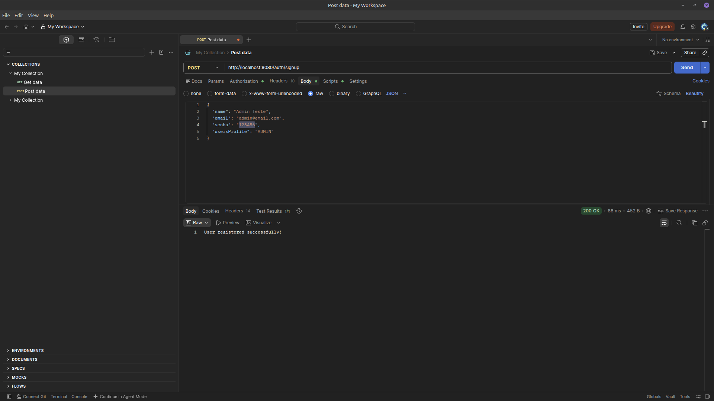

A aplicação utiliza o conceito de ```RBAC (Role-Based Access Control)```, no qual as permissões são determinadas de acordo com o perfil do usuário.

## ADMIN

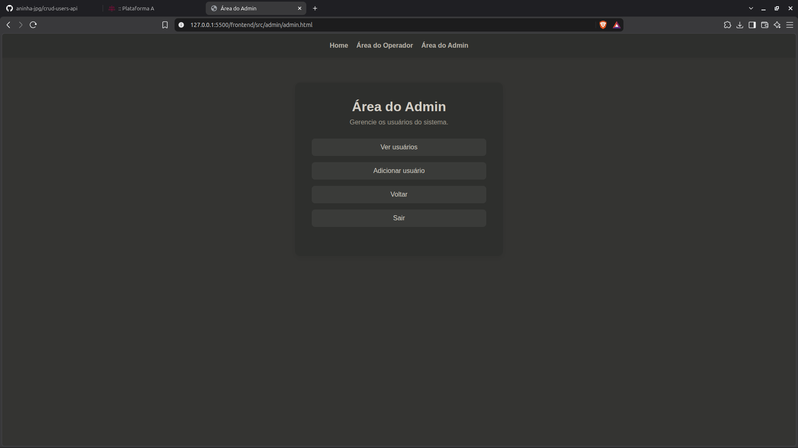

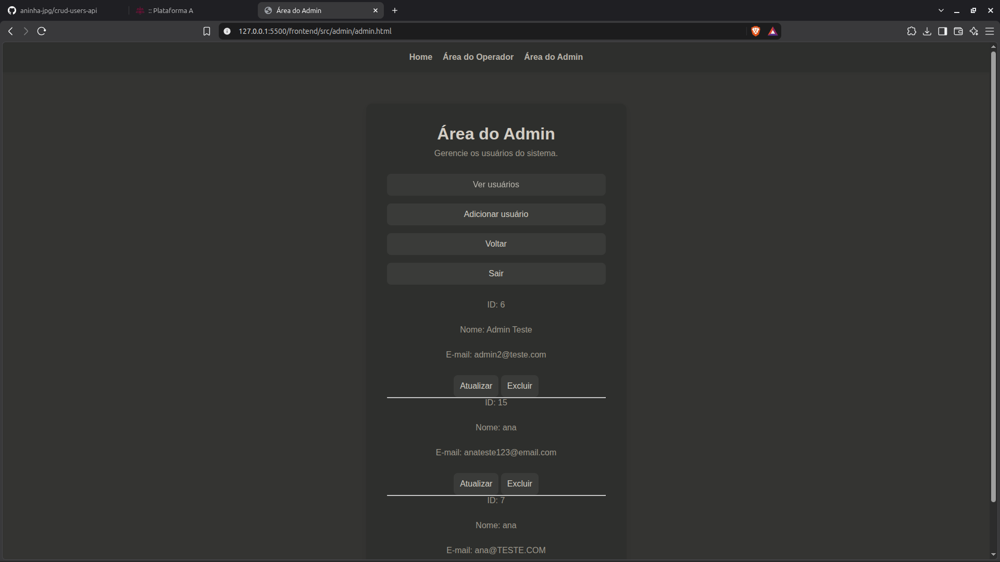

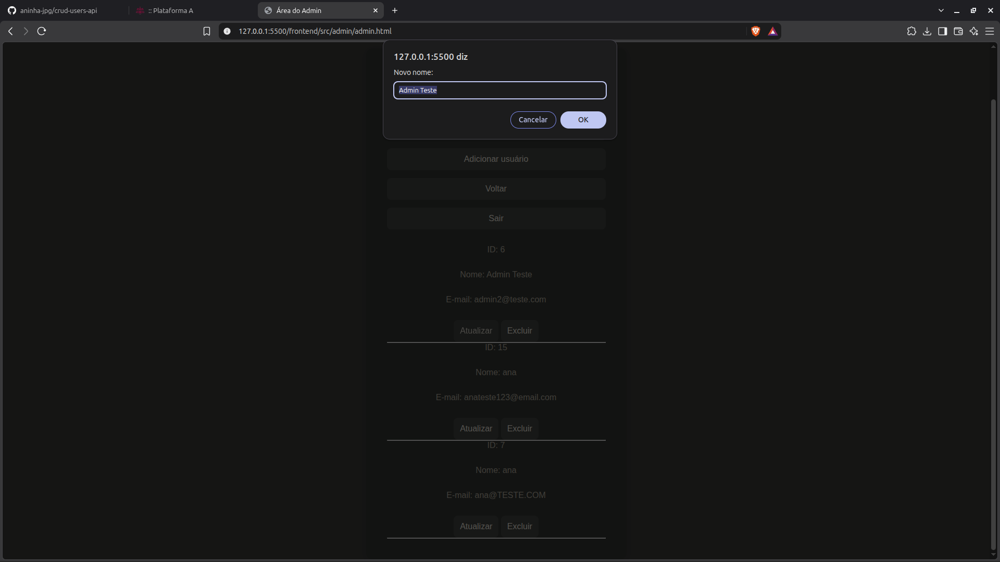

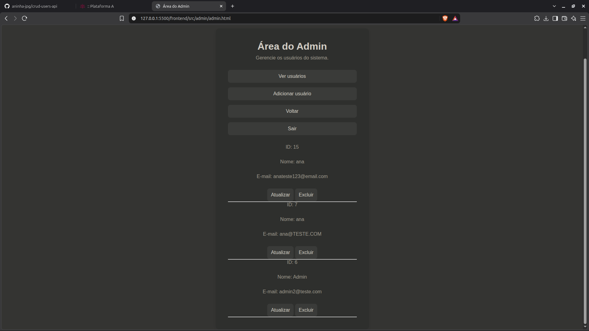

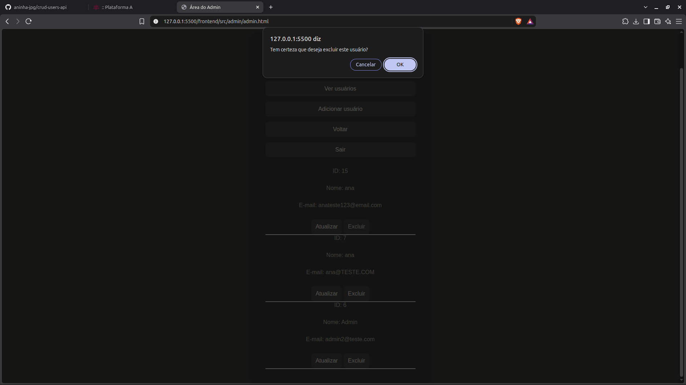

O administrador possui permissões para realizar operações de gerenciamento de usuários, como:

* Listar usuários;
* Cadastrar usuários;
* Atualizar usuários;
* Excluir usuários.


## OPERATOR


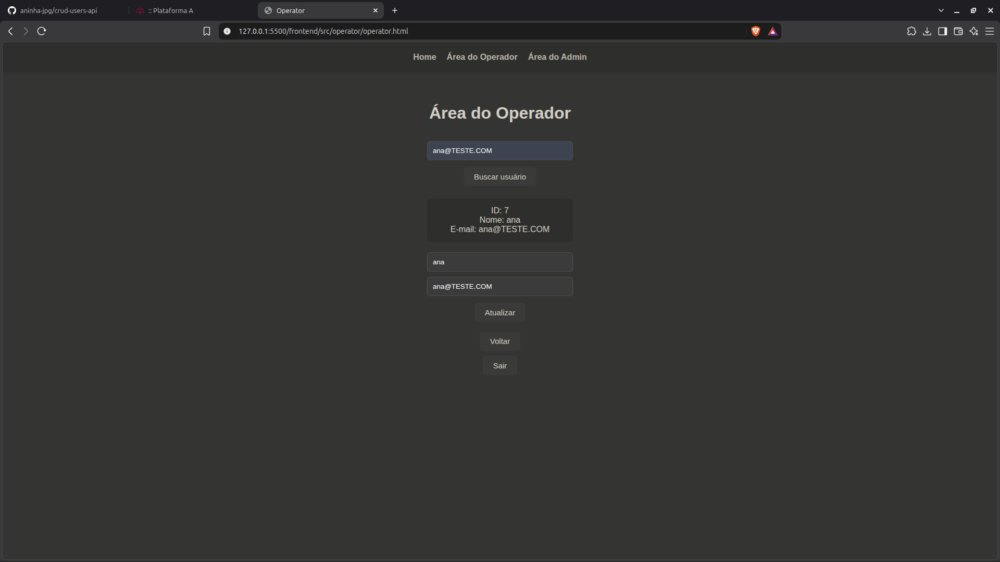

O operador possui permissões intermediárias, podendo:

* Consultar usuários;
* Atualizar informações de usuários.

## CLIENT

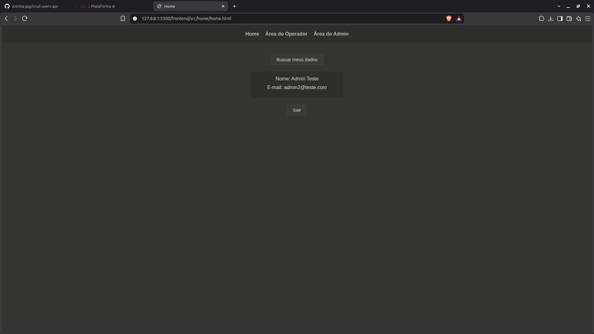

O cliente possui acesso restrito aos seus próprios dados.

A consulta dos dados do usuário autenticado é realizada através do endpoint:

```GET
GET /users/me
```

---

## 🌐 OAuth 2.0

O OAuth 2.0 não foi implementado diretamente na aplicação.

No contexto deste projeto, uma aplicação parceira poderia utilizar OAuth 2.0 para obter autorização de acesso aos recursos da API sem precisar receber ou armazenar a senha do usuário.

O fluxo poderia ocorrer da seguinte maneira:

```TEXT

Usuário

   ↓

Aplicação parceira

   ↓

Solicitação de autorização

   ↓

Usuário autoriza o acesso

   ↓

Servidor de autorização

   ↓

Token de acesso

   ↓

Aplicação parceira

   ↓

API protegida

```

O token de acesso seria utilizado pela aplicação parceira nas requisições aos recursos protegidos.

### Benefícios

Entre os principais benefícios do OAuth 2.0 estão:

* Delegação de permissões;
* Redução da necessidade de compartilhamento de senhas;
* Controle sobre os recursos acessíveis;
* Maior segurança na integração entre aplicações;
* Separação entre autenticação e autorização.

---

# ⚠️ Análise de segurança

**1. Roubo de token JWT**

**Risco:** Um atacante que obtenha um token válido pode tentar utilizá-lo para acessar recursos protegidos.

**Mitigação:**

* Utilização de HTTPS em ambientes de produção;
* Definição de tempo de expiração do token;
* Armazenamento adequado das credenciais e tokens;
* Validação do token nas requisições protegidas.

---

**2. Armazenamento inseguro de senhas**

**Risco:** Armazenar senhas em texto puro pode permitir que as credenciais dos usuários sejam expostas em caso de acesso indevido ao banco de dados.

**Mitigação:**

* As senhas são processadas utilizando um mecanismo de hash antes de serem armazenadas.
* A aplicação utiliza o PasswordEncoder disponibilizado pelo Spring Security.

---

**3. Acesso indevido aos endpoints**

**Risco:** Um usuário pode tentar acessar funcionalidades que não pertencem ao seu perfil.

**Mitigação:**

* A aplicação utiliza autenticação e autorização baseadas em perfis de usuário (RBAC).
* Dessa forma, os recursos disponíveis são controlados de acordo com o perfil autenticado.

---

## 🖥️ Front-end

Além da API, foi desenvolvida uma interface web para demonstrar as funcionalidades da aplicação.

O front-end foi desenvolvido utilizando:

* HTML;
* CSS;
* JavaScript.

---

### 🔑 Tela de Login

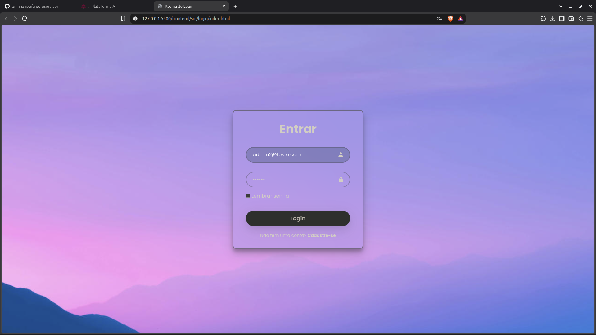

A tela de login permite que o usuário informe seu e-mail e senha para realizar a autenticação.

Após o login bem-sucedido, o token JWT é armazenado no navegador e o usuário é direcionado para a área principal da aplicação.

### 📝 Tela de Cadastro

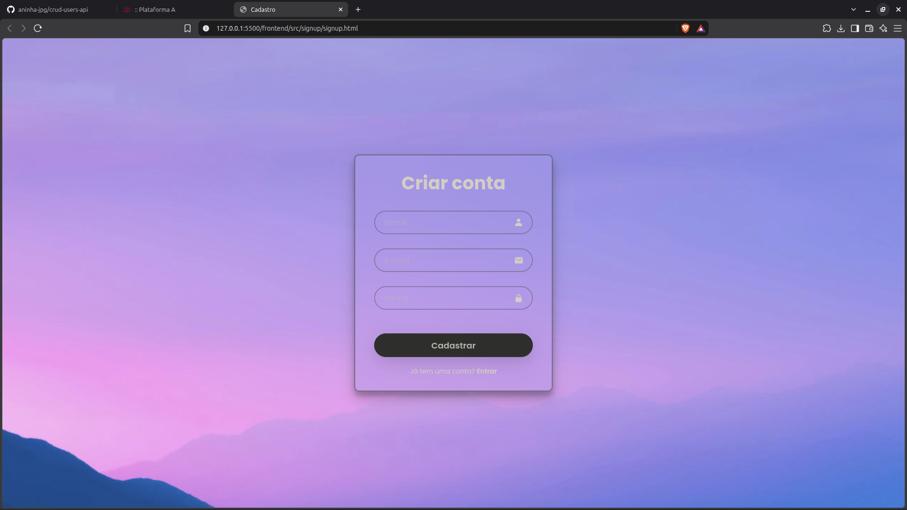

A tela de cadastro permite que novos usuários criem uma conta.

Os usuários cadastrados através dessa tela recebem automaticamente o perfil:

```TEXT
CLIENT
```

### 🏠 Home

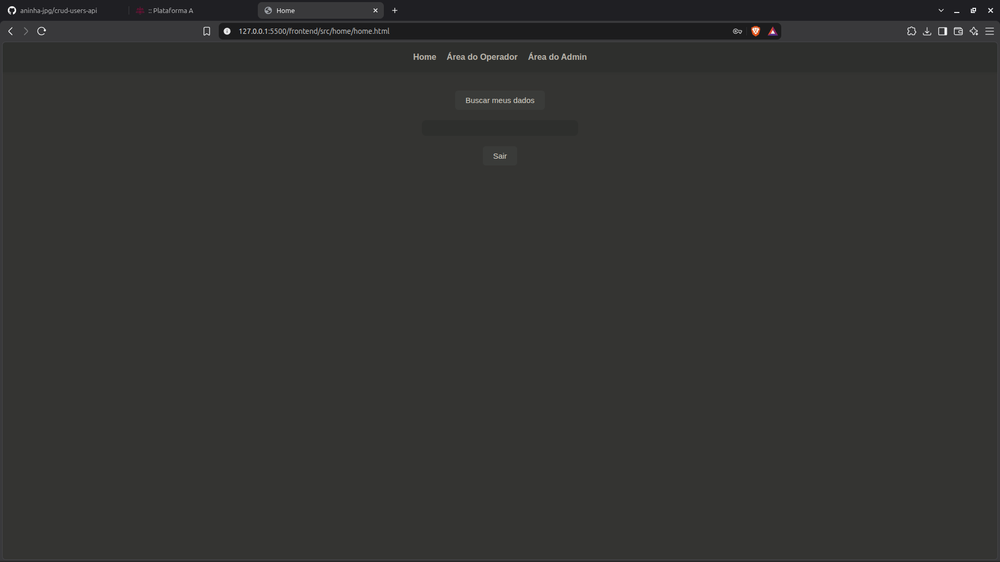


A Home apresenta os recursos disponíveis para o usuário autenticado e permite consultar seus próprios dados.

### 👨‍💻 Área do Operador


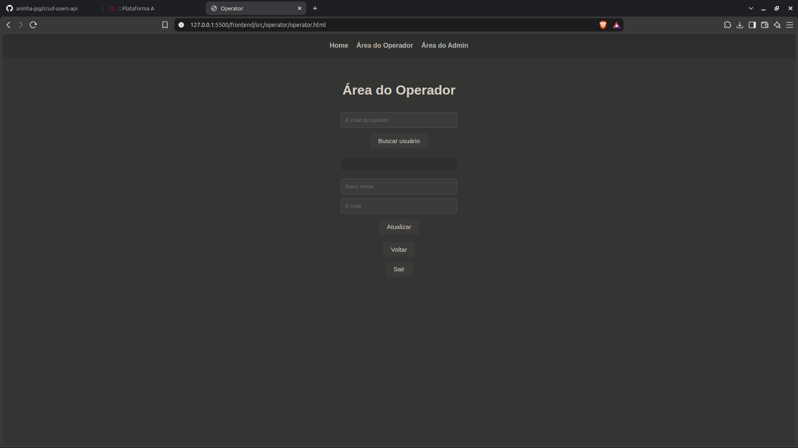

A área do operador permite consultar usuários e atualizar suas informações de acordo com as permissões do perfil ```OPERATOR```.

### 👑 Área do Administrador


A área administrativa permite realizar operações de gerenciamento de usuários, incluindo:

* Listagem;
* Cadastro;
* Atualização;
* Exclusão.

## 🔄 Fluxo da aplicação

O funcionamento geral da aplicação pode ser representado da seguinte forma:

```text

            ┌───────────────┐

            │    Usuário    │

            └───────┬───────┘

                    │

                    ▼

            ┌───────────────┐

            │     Login     │

            └───────┬───────┘

                    │

                    ▼

            ┌───────────────┐

            │  Autenticação │

            └───────┬───────┘

                    │

                    ▼

            ┌───────────────┐

            │    JWT        │

            └───────┬───────┘

                    │

                    ▼

            ┌───────────────┐

            │    Front-end  │

            └───────┬───────┘

                    │

        ┌─────────────┼─────────────┐

        │             │             │

        ▼             ▼             ▼

    CLIENT        OPERATOR        ADMIN

        │             │             │

        ▼             ▼             ▼

    Próprios       Consulta       Gestão de

    dados       e atualização    usuários

```

## 🧪 Testes

Foram realizados testes manuais e automatizados para verificar o funcionamento da aplicação.

Os testes automatizados utilizam o **H2 Database**, um banco de dados em memória, permitindo executar os testes sem depender do banco PostgreSQL da aplicação.

### Testes da API

A API foi testada utilizando o **Postman**, verificando diferentes funcionalidades e cenários:

- Cadastro de usuários;

- Login;

- Autenticação utilizando JWT;

- Consulta de dados do usuário;

- Consulta de usuários;

- Atualização de usuários;

- Exclusão de usuários;

- Controle de acesso de acordo com os perfis.

#### Testes automatizados

Também foram desenvolvidos **8 testes automatizados** para validar diferentes componentes da aplicação.

##### AuthControllerTest

Testes relacionados à autenticação e cadastro:

- Login e geração do token;

- Cadastro de usuário já existente;

- Cadastro de novo usuário.

##### UsersRepositoryTest

Testes relacionados à consulta de usuários no banco de dados:

- Busca de usuário por e-mail quando o usuário existe;

- Busca de usuário por e-mail quando o usuário não existe.

##### JwtServiceTest

Testes relacionados ao funcionamento do JWT:

- Geração do token;

- Recuperação do usuário a partir do token;

- Validação do token.

---

## ▶️ Como executar

## Pré-requisitos

Para executar o projeto localmente, é necessário possuir:

* Java;
* Maven;
* Banco de dados configurado;
* Git;
* Navegador web.


1. Clonar o Projeto

```Bash
    git clone https://github.com/aninha-jpg/crud-users-api
```

2. Executar o back-end

Acesse o diretório do back-end e execute:

```bash
    mvn spring-boot:run
```

A API será disponibilizada localmente em:

```bash
    http://localhost:8080
```

3. Executar o front-end

O front-end está localizado no diretório:

```bash
    frontend/src/
```

A aplicação pode ser executada através de um servidor local ou conforme a configuração utilizada no ambiente de desenvolvimento.

---

### Swagger UI

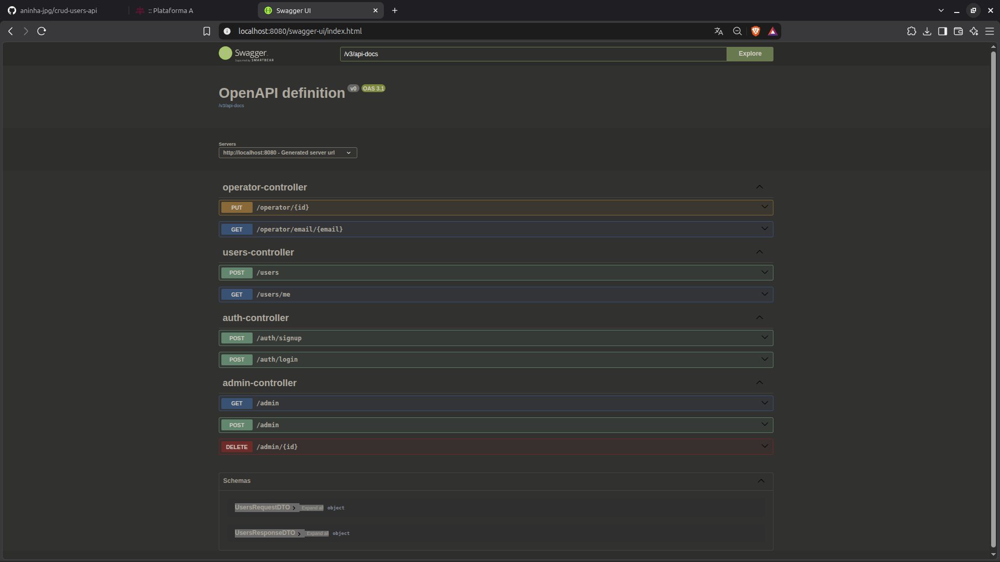

Com a aplicação em execução, a documentação interativa da API pode ser acessada em:

`http://localhost:8080/swagger-ui/index.html`

---

## 📁 Estrutura do projeto

### 📁 Estrutura do Back-end

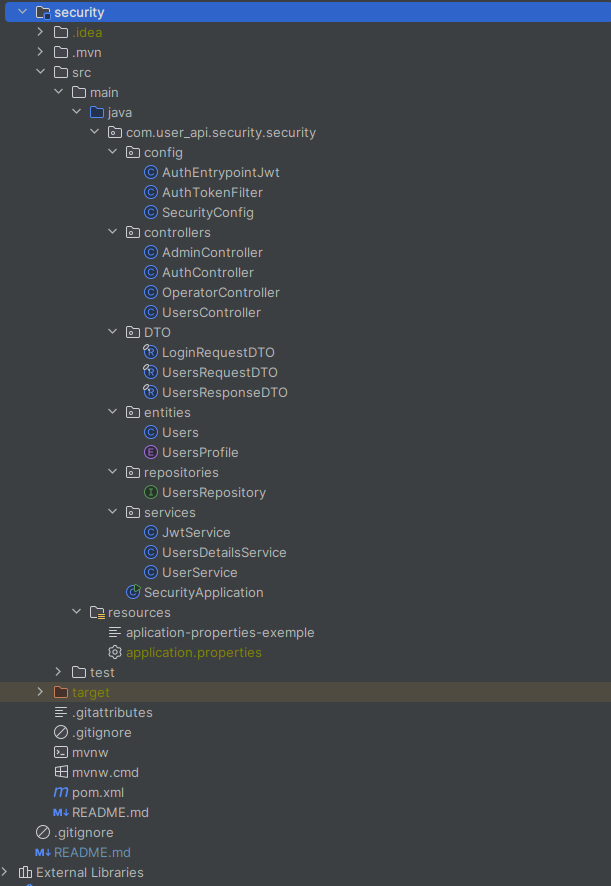

### 📁 Estrutura do Front-end

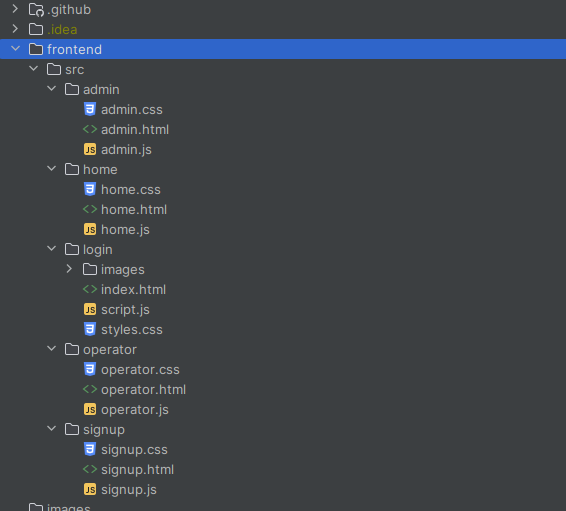

--- 

## 📚 Conceitos aplicados

Durante o desenvolvimento foram aplicados conceitos relacionados a:

* Arquitetura REST;
* Métodos HTTP;
* APIs REST;
* Spring Boot;
* Spring Security;
* JWT;
* Autenticação;
* Autorização;
* RBAC;
* CRUD;
* Hash de senhas;
* Integração entre Front-end e Back-end;
* Consumo de APIs utilizando JavaScript;
* Testes de API;
* Git e GitHub.

---

## 🎓 Finalidade acadêmica

Este projeto foi desenvolvido como atividade acadêmica com o objetivo de demonstrar a aplicação prática dos conceitos estudados sobre desenvolvimento de APIs REST, autenticação, autorização e segurança de aplicações web.

## 👩‍💻 Autoria

Projeto desenvolvido para fins acadêmicos.

Ana Luiza, Estudante de Análise e Desenvolvimento de Sistemas.